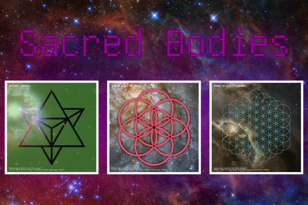

    
    
A collection of NFT items generated from Sacred Geometry, Hubble Space Telescope images, and Chakra colors.

* [Hubble photos use policies](https://hubblesite.org/copyright)
* [GitHub Repository](https://github.com/sk33z3r/sacred-bodies)

# Generation Logic

Each item is compiled by randomly choosing an attribute for each trait, each having their own chance to occur.

## Traits

### Chakra

Determines the color of the shape, and prints the associated Sanskrit Chakra name onto the image.

| Sanskrit Name | Color  | Chance (%) |
|---------------|--------|------------|
| Muladhara     | Red    | 20         |
| Svadhishtana  | Orange | 20         |
| Manipura      | Yellow | 15         |
| Anahata       | Green  | 15         |
| Vishuddha     | Blue   | 15         |
| Ajna          | Indigo | 10         |
| Sahasrara     | Purple | 5          |

### Cover Type

Determines whether the shape's color fills the image or not.

| Type | Description                                                  | Chance (%) |
|------|--------------------------------------------------------------|------------|
| Full | Color fills the image, with the shape cut out of the middle. | 85         |
| Thin | Only the shape is colored.                                   | 15         |

### Shape

Determines the shape to use.

| Shape             | Chance (%) |
|-------------------|------------|
| Flower of Life    | 10         |
| Fruit of Life     | 20         |
| Merkaba           | 35         |
| Metatron's Cube   | 15         |
| Seed of Life      | 15         |
| Vesica Pisces     | 5          |

### Opacity Level

Determines the opacity level of the color layer when the type is `Full`.

| Level (%) | Chance (%) |
|-----------|------------|
| 50        | 75         |
| 35        | 25         |

### Hubble Image

Determines which Hubble Telescope image to use from a pool of 30 images.

| Image Title                       | Chance (%) |
|-----------------------------------|------------|
| Abell S1063                       | 2          |
| AG Carinae                        | 2          |
| AM 2026-424                       | 2          |
| Bat Shadow                        | 4          |
| Cosmic Reef                       | 4          |
| Crab Nebula                       | 2          |
| CW Leonis                         | 2          |
| Dark Rays in IC 5063              | 4          |
| Eta Carinae                       | 2          |
| Galaxy D100                       | 6          |
| H-alpha Tail of D100              | 6          |
| HOPS Sources in Orion             | 2          |
| Intracluster Light in MACS J0416  | 2          |
| Molten Ring Galaxy                | 4          |
| NGC1052-DF2                       | 6          |
| NGC 2276                          | 4          |
| NGC 2276 Wide-Field               | 2          |
| NGC 2292 and NGC 2293             | 6          |
| NGC 2525                          | 2          |
| NGC 4485                          | 4          |
| NGC 6302 The Butterfly Nebula     | 4          |
| NGC 6397                          | 6          |
| NGC 7027                          | 4          |
| Phoenix Cluster                   | 2          |
| Southern Crab Nebula              | 2          |
| Spiral Galaxy NGC 3147            | 2          |
| Spiral Galaxy UGC 2885            | 2          |
| Supernova Remnant 1E 0102         | 2          |
| Triangulum Galaxy-M33-Crop        | 6          |
| Westerlund 2                      | 2          |

### Crop Location

Determines where the hubble image should be cropped.

| Location | Description                  | Chance (%) |
|----------|------------------------------|------------|
| Center   | Use the center of the image. | 15         |
| Random   | Pick a random spot.          | 85         |